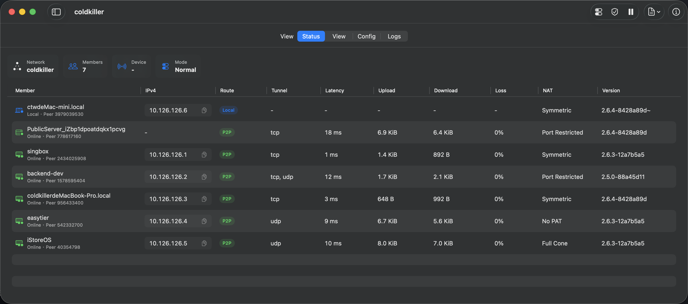
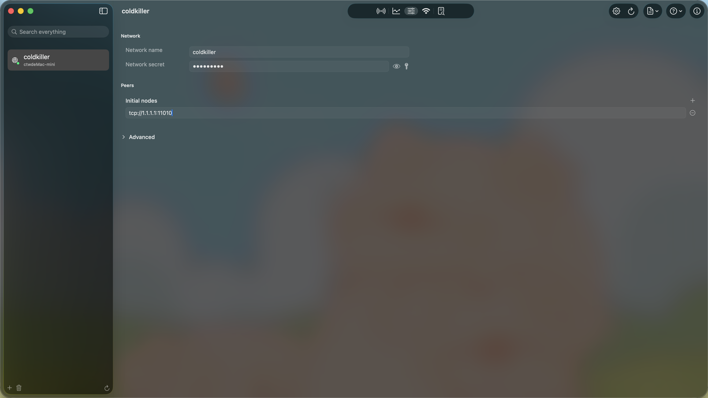
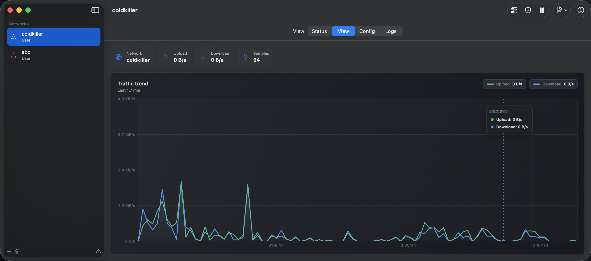
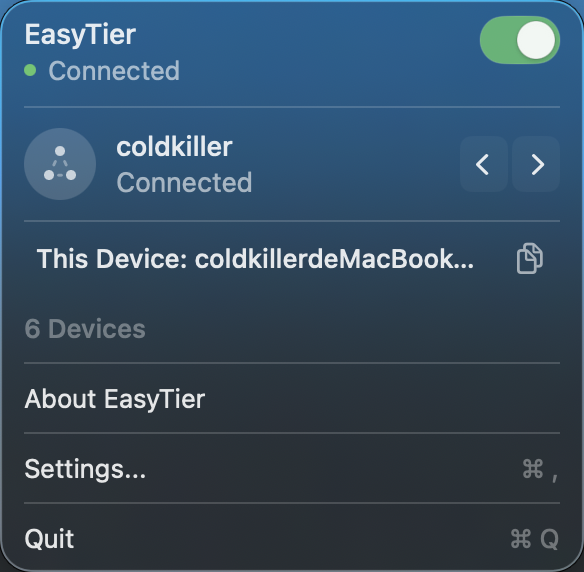
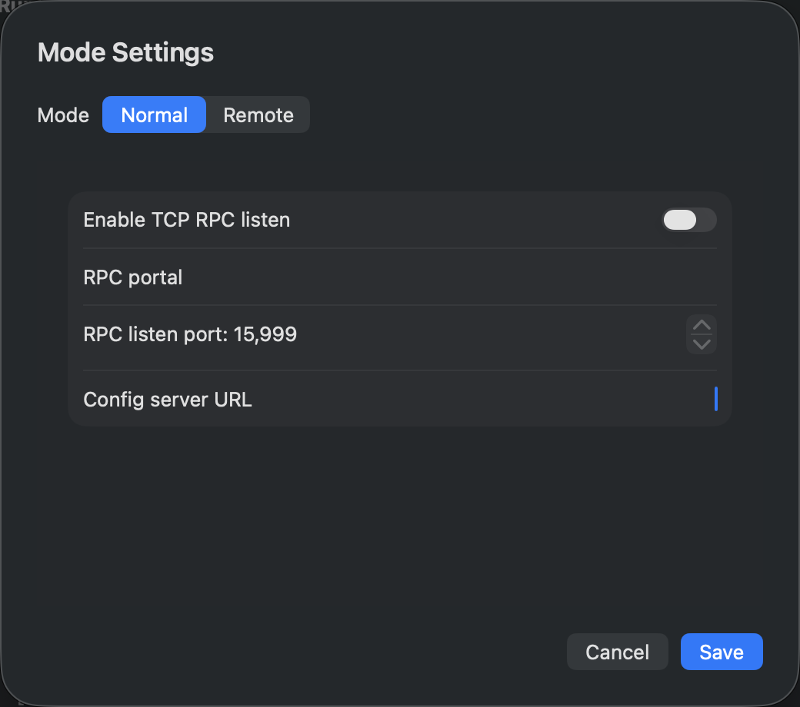
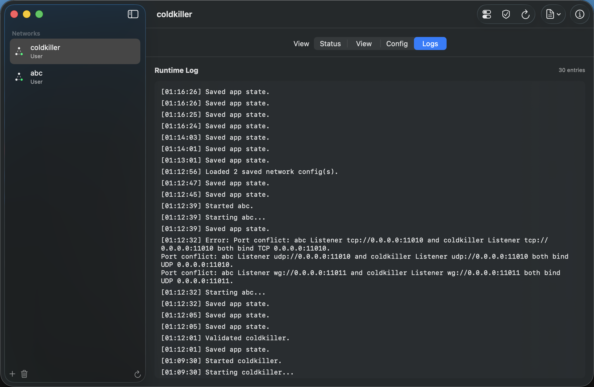

<div align="center">
  <br />
  

  <h1>EasyTier for macOS</h1>

  <p>
    EasyTier 的 Mac 客户端。把你散落在家里、办公室、云上的电脑拉进同一个虚拟局域网，互相访问就像接在同一台交换机旁边。不用记命令行参数，不用对着配置文件挠头，大部分时候点几下就完事。
  </p>
  <p>
    装好之后，菜单栏会常驻一个小图标——网络什么状态、谁在线、跑得快不快，扫一眼就有数。
  </p>

  <p>
    
    
    <a href="https://github.com/socoldkiller/easytier-macos/stargazers">
      
    </a>
    <a href="LICENSE">
      
    </a>
  </p>

  <p>
    <a href="#截图">截图</a>
    ·
    <a href="#它能做什么">它能做什么</a>
    ·
    <a href="#安装">安装</a>
    ·
    <a href="#自己构建">自己构建</a>
    ·
    <a href="#star-历史">Star 历史</a>
    ·
    <a href="#致谢">致谢</a>
  </p>

  <br />
</div>

---

## 截图

应用的主界面 —— 左栏切网络，右栏看状态、设备、流量、日志。

<div align="center">
  

  <br /><br />

  
  &nbsp;
  

  <br /><br />

  
  &nbsp;
  

  <br /><br />

  
</div>

## 它能做什么

### 菜单栏常驻

App 收进菜单栏之后，那个小图标就替你看网络了。灰色是没在跑，绿色是全通，红色是出了状况，连接过程中会一闪一闪。点一下弹出面板，当前网络、在线设备、本地 IP 都在里面，不用专门打开主窗口。

### 设备列表

当前网络里的节点都在一张表里：谁在线、走的是 P2P 还是 Relay、隧道用 TCP / UDP / QUIC 哪种协议、延迟多少、传了多少流量、丢没丢包、NAT 是什么类型、EasyTier 什么版本，一眼看全。IP 点一下就复制；双击设备名还能直接改名，改完通过 RPC 同步到远端节点，不用再登录那台机器去折腾。

### 流量图表

上传和下载画成面积图，每秒刷新，鼠标悬停能看具体数值。Y 轴会自动缩放，偶尔来个流量尖峰，也不会把整条曲线压成一条直线。

### 多网络配置

想维护几套网络都行，各开各的，互不干扰，用 Cmd+[ / Cmd+] 就能来回切。配置存在本机数据库里，网络密钥单独放在钥匙串中；TOML 保留给显式导入导出，和 EasyTier 命令行配置格式互通。

### 运行日志

EasyTier 内核的输出和 App 自己的操作记录都收在同一个日志面板里，能搜索、能复制。出了状况，起码知道该从哪里看起。

### 发布服务（Beta）

把虚拟局域网里的某个服务，通过 HTTPS 域名暴露到公网。证书自动申请、自动续期（Let's Encrypt），支持 HTTP-01 和 DNS-01（含通配符）。想给家里的服务开个公网入口，又不想自己折腾证书和反代的话，可以试试这个。

### 睡醒自动恢复

笔记本合盖睡了一觉，醒来网络会自动重新连上，不用手动重开。

### 开机自启，退出后也能继续跑

可以设成登录时自动启动；也可以让网络在 App 退出之后继续跑，需要的时候再从菜单栏接管。

### 自动更新

内置 Sparkle，可以在 Stable 和 Nightly 两条轨道里选。Nightly 每晚从最新代码构建，适合想提前尝鲜、也受得了不稳定的人。

### 还有这些小地方

- 全局搜索：在侧边栏直接搜网络、设备和 IP，不用挨个翻
- no_tun 模式：不想创建 TUN 网卡也能用
- Magic DNS：只接管 EasyTier 自己域名的解析，其他照旧走系统 DNS
- 无障碍：VoiceOver、减少动态效果、减少透明度都照顾到了
- 应用里附了 Linux 安装指南，给远程 Linux 节点装客户端时有参照

## 安装

需要 macOS 15 及以上。

去 [Releases](https://github.com/socoldkiller/easytier-macos/releases) 下载最新的 DMG，拖进 Applications 就行。

从 v1.4.0 开始支持应用内更新（EasyTier > Check for Updates…），以后不用再手动换 DMG。v1.3.3 及更早版本没有内置更新机制，升到 v1.4.0 还是得手动装一次。

Settings > General > Software Update 里可以选 Latest Stable 或 Nightly。切回 Stable 只影响后续更新轨道，不会自动降级当前版本。

首次启动：

1. 发布用的 DMG 经过 Developer ID 签名和 Apple 公证。如果 macOS 提示无法验证开发者，别绕过 Gatekeeper，重新下载并提 Issue
2. 首次启动会提示安装 Helper，按系统弹窗操作
3. 开了防火墙的话，允许 EasyTier 的入站连接

## 自己构建

需要 Xcode 16+（Swift 6）、Rust 1.95+ stable 工具链和 protoc。

```bash
git clone --recurse-submodules https://github.com/socoldkiller/easytier-macos.git
cd easytier-macos

make bootstrap   # 检查工具链
make ffi         # 编译当前架构的 Core/Gateway FFI 静态库
make test        # 跑 Swift 和 Rust 测试
```

本地调试直接 `open EasyTier.xcodeproj`，跑 EasyTierMac scheme 就行。打包发布需要 Developer ID 证书、对应的 provisioning profile 和 Sparkle 密钥，完整流程见 [Packaging/RELEASE.md](Packaging/RELEASE.md) 和 [Packaging/SPARKLE.md](Packaging/SPARKLE.md)。

## Star 历史

<div align="center">
  <a href="https://www.star-history.com/#socoldkiller/easytier-macos&Date">
    <picture>
      <source media="(prefers-color-scheme: dark)" srcset="https://api.star-history.com/svg?repos=socoldkiller/easytier-macos&type=Date&theme=dark" />
      <source media="(prefers-color-scheme: light)" srcset="https://api.star-history.com/svg?repos=socoldkiller/easytier-macos&type=Date" />
      
    </picture>
  </a>
</div>

## 致谢

组网能力来自 [EasyTier](https://github.com/EasyTier/EasyTier)，这个项目是它的 Mac 原生客户端。

Bug 和建议去 Issues 提，想动手直接 PR。用着顺手的话，赏个 Star 吧。

## License

MIT。EasyTier Core 及其依赖遵循各自的许可证。
