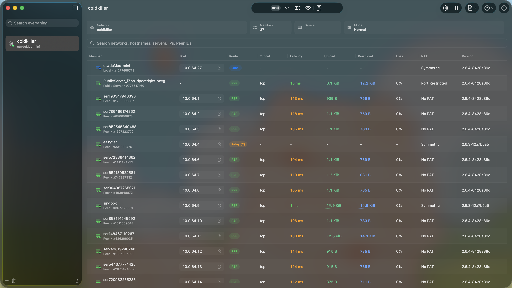
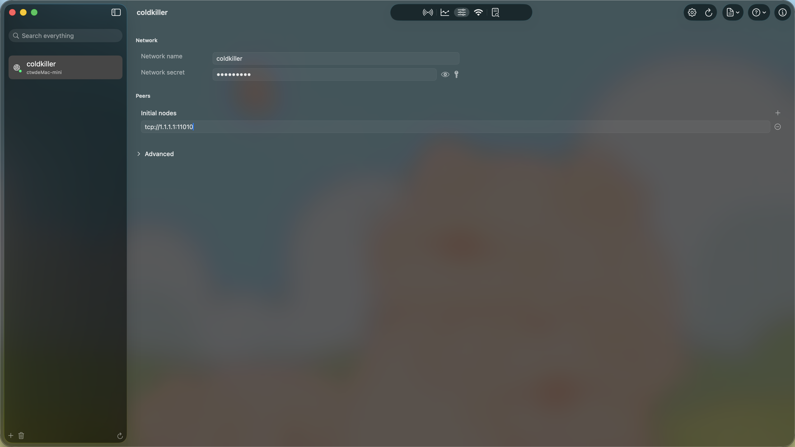
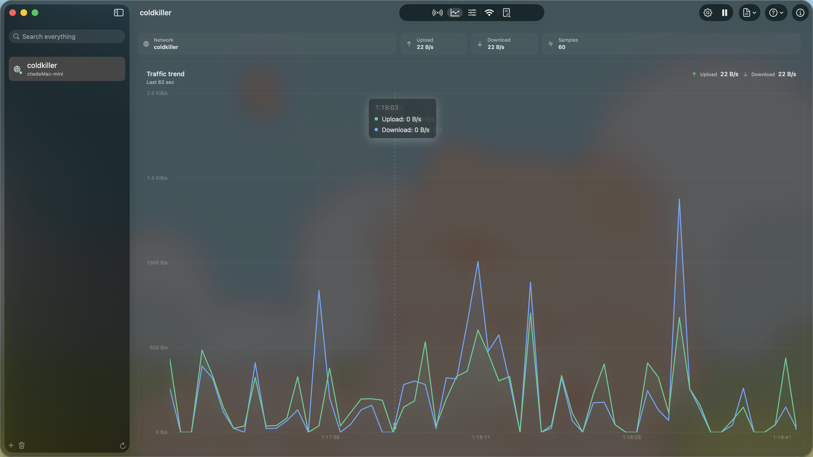
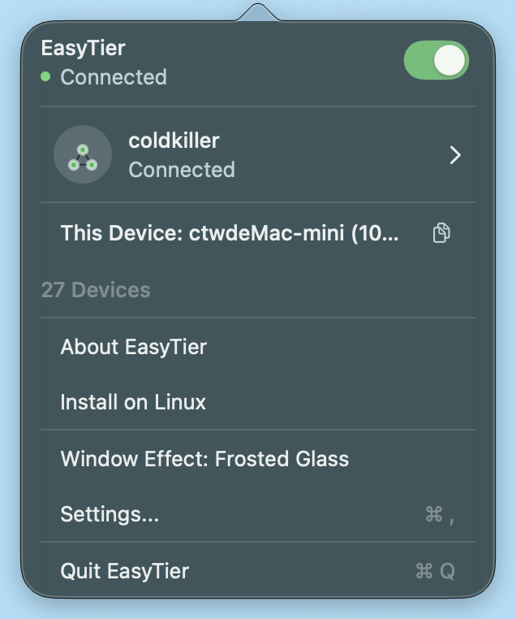
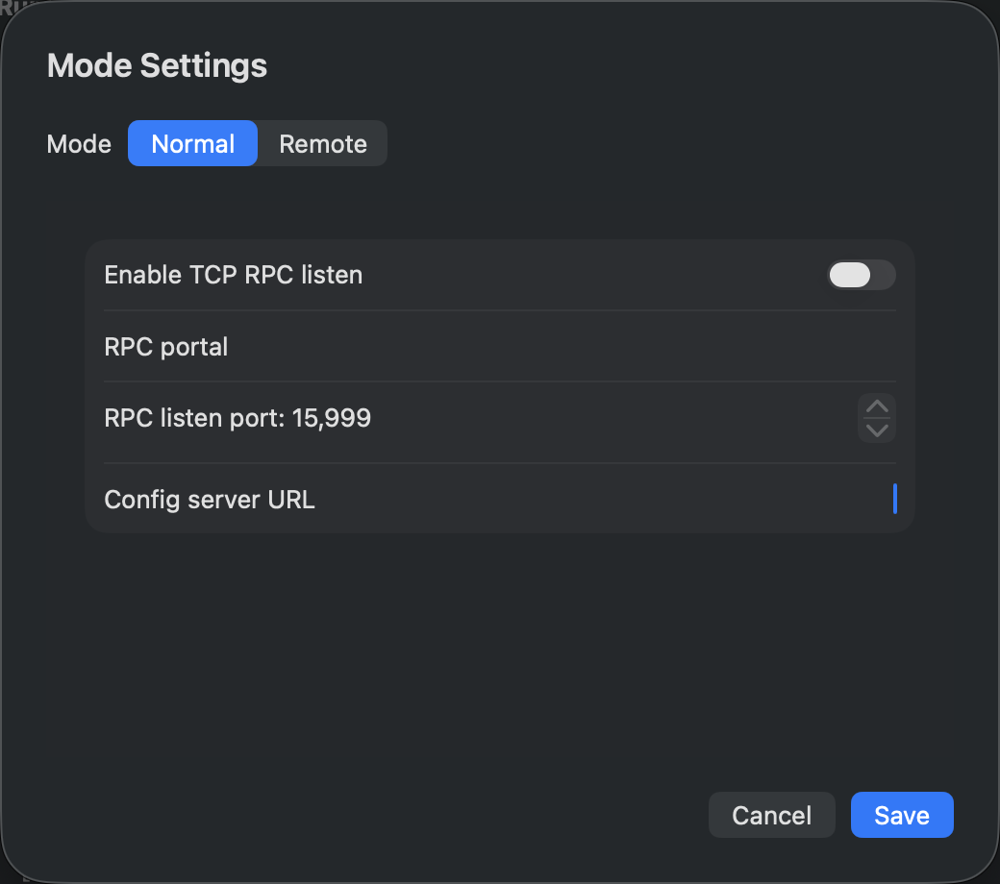
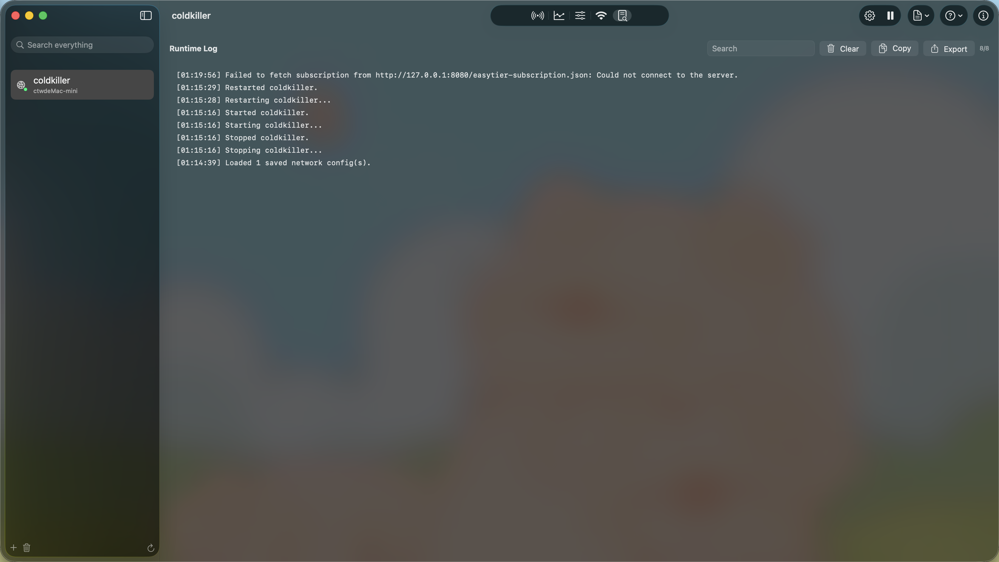

<div align="center">
  <br />
  

  <h1>EasyTier for macOS</h1>

  <p>
    Put your home NAS, office machines, and cloud servers on a single virtual LAN. Devices talk to each other like they're plugged into the same switch, wherever they are.
  </p>

  <p>
    
    
    <a href="https://github.com/socoldkiller/easytier-macos/stargazers">
      
    </a>
    <a href="LICENSE">
      
    </a>
  </p>

  <p>
    <a href="#screenshots">Screenshots</a>
    ·
    <a href="#features">Features</a>
    ·
    <a href="#install">Install</a>
    ·
    <a href="#build">Build</a>
    ·
    <a href="#star-history">Star History</a>
    ·
    <a href="#credits">Credits</a>
  </p>

  <br />
</div>

---

## Screenshots

<div align="center">
  

  <br /><br />

  
  &nbsp;
  

  <br /><br />

  
  &nbsp;
  

  <br /><br />

  
</div>

## Features

### Menu bar

The menu bar icon shows connection state — gray stopped, green connected, red error. Click it for a panel with network name, local IP, and online device count.

### Device table

Every node on the current network in one table:

- Hostname, role (Self / Peer / Public Server), and Peer ID
- Virtual IPv4 — click to copy
- Route type: Local, P2P, Relay
- Tunnel protocol: TCP, UDP, QUIC, etc.
- Latency, upload, download, packet loss
- NAT type and EasyTier version

Double-click a device name to rename it. The change propagates to the remote node over RPC.

### Traffic chart

Upload and download trends as a per-second area chart. Hover for exact values. Top bar shows current rate and sample count.

### Multi-network configs

Each network gets its own configuration. Start and stop them independently.
- Network name and secret
- Initial node list — add or remove as needed
- Magic DNS, tunnel protocol, and other advanced options
- TOML format, compatible with the EasyTier CLI

### Peer subscriptions

Paste a subscription URL or JSON to import peer addresses. Each source shows as a card — refresh on demand.

### Magic DNS

Configure DNS suffix, split DNS routing, and local resolver. Only names under the suffix go through EasyTier; everything else stays on system DNS.

### Runtime logs

App actions and EasyTier Core output go to a single panel. Search, clear, copy, export.

### Privileged helper

TUN interfaces need root. Starting a TUN network shows an inline prompt to install a privileged helper (LaunchDaemon) that communicates over XPC. Non-TUN mode doesn't need it.

## Install

macOS 15 or later.

Grab the DMG from [Releases](https://github.com/socoldkiller/easytier-macos/releases) and drop it into Applications.

First launch:
1. macOS may flag it as unidentified → System Settings → Privacy & Security → Open Anyway
2. TUN mode prompts for the privileged helper → follow the dialogs
3. If your firewall is on → allow incoming connections for EasyTier

## Build

### Prerequisites

Xcode 16+, Swift 6, Rust nightly.

```bash
git clone --recurse-submodules https://github.com/socoldkiller/easytier-macos.git
cd easytier-macos
make bootstrap   # verify toolchain
make ffi         # build Rust FFI static lib
make app-debug   # build debug app
make dmg-local   # package locally-signed DMG
make test        # run tests
```

Output paths:
- App bundle: `.build/artifacts/EasyTier.app`
- DMG: `.build/artifacts/EasyTier-macOS-$(uname -m).dmg`
- FFI lib: `Vendor/Frameworks/static/`

Developer ID signing:

```bash
make dmg-signed CODESIGN_IDENTITY="Developer ID Application: Name (TEAMID)"
```

### Call path

The SwiftUI app talks to EasyTier Core through a C shim (CEasyTierFFI) backed by a Rust FFI library. In TUN mode, the app communicates with a privileged helper over XPC, and the helper calls into the same FFI layer. Remote RPC builds JSON-RPC payloads in Swift and sends them through the C shim to a remote RPC Portal.

## Star History

<div align="center">
  <a href="https://www.star-history.com/#socoldkiller/easytier-macos&Date">
    <picture>
      <source media="(prefers-color-scheme: dark)" srcset="https://api.star-history.com/svg?repos=socoldkiller/easytier-macos&type=Date&theme=dark" />
      <source media="(prefers-color-scheme: light)" srcset="https://api.star-history.com/svg?repos=socoldkiller/easytier-macos&type=Date" />
      
    </picture>
  </a>
</div>

## Credits

Built on [EasyTier](https://github.com/EasyTier/EasyTier). SwiftUI frontend, Rust FFI calling EasyTier Core.

Bugs and feature requests go in Issues. Pull requests welcome.

## License

MIT. EasyTier Core and its dependencies follow their own licenses.
